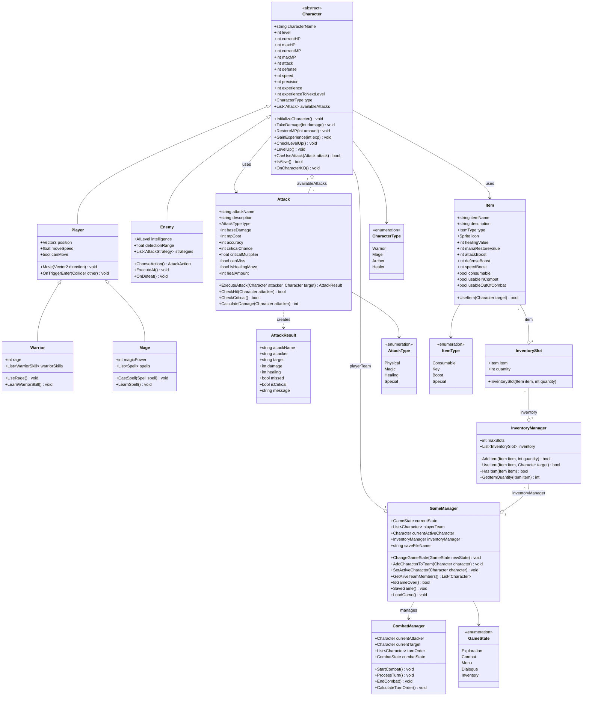

# Diagramme de Classes - UniQuest RPG

## Architecture Générale

## Description des Classes Principales

### 🧙‍♂️ **Character (Classe Abstraite)**
- **Rôle** : Classe de base pour tous les personnages (joueurs et ennemis)
- **Responsabilités** : 
  - Gestion des statistiques (PV, PM, attaque, défense, etc.)
  - Système de niveau et d'expérience
  - Gestion des attaques disponibles
  - Mécaniques de combat de base

### ⚔️ **Attack (ScriptableObject)**
- **Rôle** : Définit les attaques disponibles dans le jeu
- **Responsabilités** :
  - Calcul des dégâts et de la précision
  - Gestion des coups critiques
  - Exécution des attaques avec résultats détaillés

### 💰 **Item & InventoryManager**
- **Rôle** : Gestion complète du système d'inventaire
- **Responsabilités** :
  - Stockage et organisation des objets
  - Utilisation des objets (potions, clés, boosts)
  - Vérification de la disponibilité des objets

### 🎮 **GameManager (Singleton)**
- **Rôle** : Manager principal du jeu
- **Responsabilités** :
  - Gestion de l'état du jeu (exploration, combat, menus)
  - Gestion de l'équipe du joueur
  - Sauvegarde et chargement des données

## Avantages de cette Architecture

### ✅ **Modularité**
- Chaque classe a une responsabilité claire
- Facile d'ajouter de nouveaux types de personnages ou d'attaques

### ✅ **Extensibilité**
- Héritage pour les différents types de personnages
- ScriptableObjects pour créer facilement des attaques et objets

### ✅ **Réutilisabilité**
- Les classes de base peuvent être étendues
- Les systèmes sont indépendants les uns des autres

### ✅ **Testabilité**
- Chaque composant peut être testé individuellement
- Séparation claire des responsabilités

## Prochaines Étapes d'Implémentation

1. **Étape 2** : Aminata → Map & Déplacement (Player movement)
2. **Étape 3** : Tous → Système de combat (CombatManager)
3. **Étape 4** : Spécialisations des personnages (Warrior, Mage, etc.)
